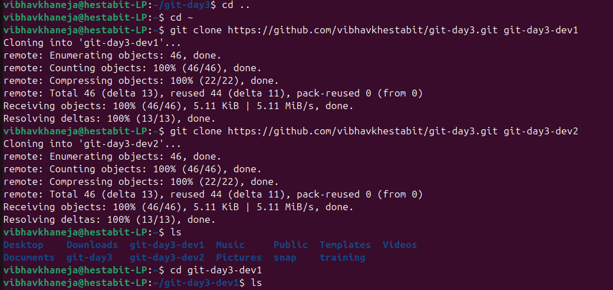
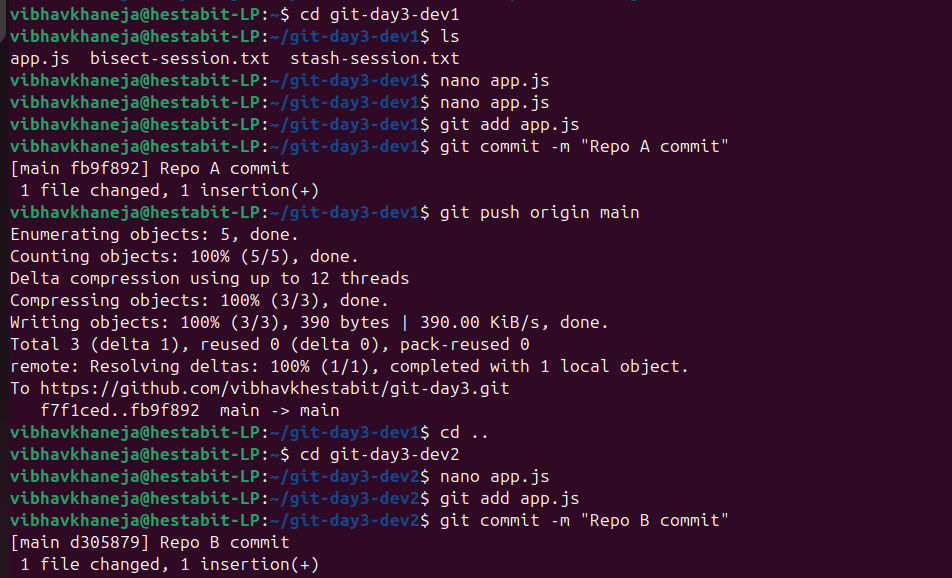
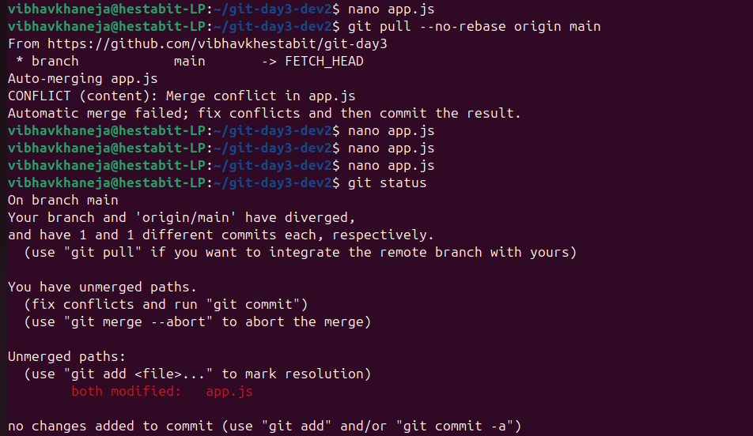
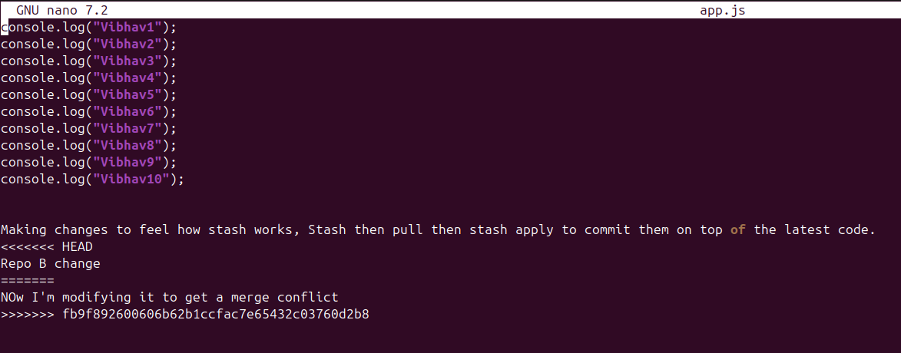
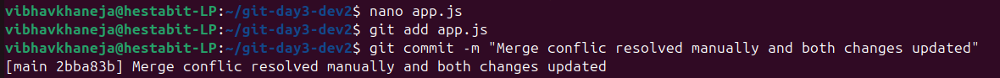
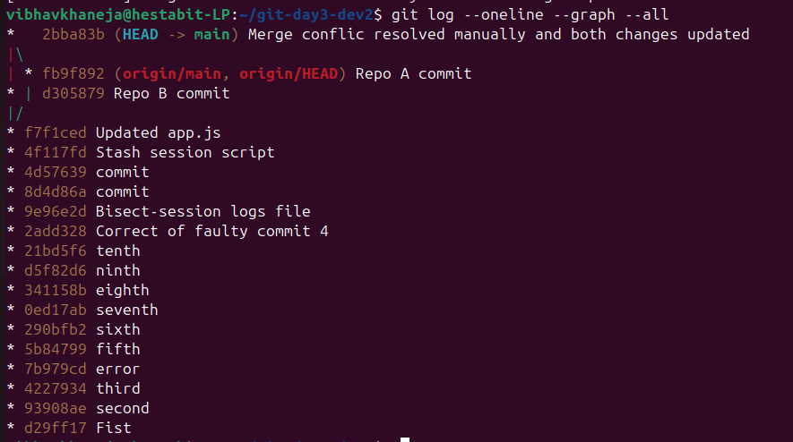

This is my Merge PostMortem file which will help us undertsand why merge conflicts are caused, and how to solve them.

We have to start by creating 2 clones of our main repository or that when we simultaneously work in the same file then we face conflict error.

We will go through the commands of git add, git commit, git push, git pull rejects our request, then we have to use git pull --no-rebase which basically works as git fetch+ git merge.

Lets start the process and go step by step:

**Step 1: Creation of two clone repos**

**Step 2: Making changes in both repos**

Now first we will make a change in our Repo 1, add it to the staging area and then commit it.
Then we will push our committed change.
Now we will make changes in the same line of the same file without pulling are changes properly and commit them.

Now when we tried to pull it, then it rejected our request because it found some errors as same lines and file were being modified simultaneously. so we will git pull --no-rebase which works as git fetch + git merge.

Now we will see our file with merge conflicts which needs to be removed manually.

Here after updating and removing the merge conflict we will add them to staging area and commit them.

Here is the final graph as mentioned in the deliverables where we learnt how to avoid and solve merge conflicts.

